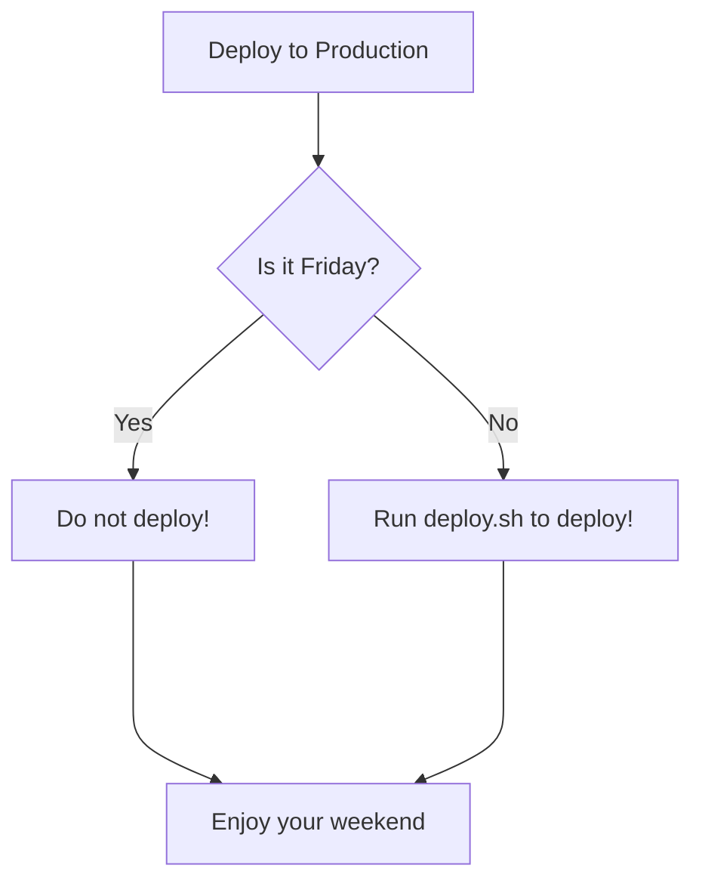

# Mermaid POC

[Mermaid](https://github.com/mermaid-js/mermaid#readme) is a JavaScript based diagramming and charting tool that takes Markdown-inspired text definitions and creates diagrams dynamically in the browser. It supports a bunch of different common diagram types for software projects, including flowcharts, UML, Git graphs, user journey diagrams, and even the dreaded Gantt chart.

[Github has rolled out](https://github.blog/2022-02-14-include-diagrams-markdown-files-mermaid/) a change that will allow you to create graphs inline using [Mermaid syntax](https://mermaid-js.github.io/mermaid/#/n00b-syntaxReference?id=syntax-structure).

Supported diagram types:

* [flowchart](https://mermaid-js.github.io/mermaid/#/flowchart)
* [sequence diagram](https://mermaid-js.github.io/mermaid/#/sequenceDiagram)
* [class diagram](https://mermaid-js.github.io/mermaid/#/classDiagram)
* [state diagram](https://mermaid-js.github.io/mermaid/#/stateDiagram)
* [entity relationship diagram](https://mermaid-js.github.io/mermaid/#/entityRelationshipDiagram)
* [user journey](https://mermaid-js.github.io/mermaid/#/user-journey)
* [gantt](https://mermaid-js.github.io/mermaid/#/gantt)
* [pie chart](https://mermaid-js.github.io/mermaid/#/gantt)
* [requirement diagram](https://mermaid-js.github.io/mermaid/#/gantt)

## Flowchart examples

This is an example of a simple flowchart.

This is an example of a more advanced flowchart, it uses different block shapes and arrow captions.

